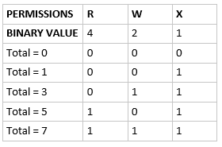

# Bash Commands Cheatsheet

- In Linux everything is a file and there are no extensions. They are just different files that take different formats.

- Linux is case-sensitive

- Spaces are hard so avoid them in making names etc.


```bash
$ mkdir my documents
$ mkdir "my documents"
```
- The first line will create two folders: `my` and `documents`
- The second line will create a single folder called ``` `my documents` ```

- Hidden files start with a `.` - e.g. `.git` is hidden. To view them one would use `ls -a`

- Use `rm -rf` to remove files or directories. `-rf` will remove them forcibly (`-f`) and recursively (`-r` removes the folder and all of it's subdirectories and contents)

- `ll` = `ls -al` - shows files and their permissions

- Flags for bash commands are options

- Check the manual using `man <command>`. You can find detailed information on each command using them.

<br>

**Wildcards**
- These are used to define some pattern for searching or matching text/string
- Wildcards inclue: `*`, `?` and `[]`
    1. `*` is used to search for certain characters that occur  0 or more times
    2. `?` is used to search for a fixed numer of characters, each `?` indicates each character
    3. `[]` is used to match the characters of a defined range or group of characters

- Examples:
    - `ls *.md` - shows all files that have the extension `.md`
    - `ls *_file.*` - shows all files that contain `_file` in it's name

    - `ls ???.md` - shows all files that have a name 3 characters long and ends with `.md`
    - `ls *.??` - returns any file whose extension is 2 characters long (e.g. `.md`)

<br>

**Permissions**
- We have `user` (u), `group` (g) and `other` (o)

- The permissions use binary so:
    - Execute (x) = 1 
    - Write (w) = 2
    - Read (r) = 4

- You can combine permissions to make a maximum of 7 options

    

- You can change permissions using `chmod`

- A file is usually given as `User/Group/Other`, so a file with permissions `7/7/7` means that user, group and others all have Read, Write and Execute permissions

- Example:
    - `7/7/0` - user and group have full permissions but others do not

<br>

**Root User**
- The root user is the super user -- the administrator

- You can escalate privileges using `sudo`

- You can also make a user `sudo users` list in the system to make other users super users

<br>

**Head, Tail and Sort**

```bash
$ head -n 2 example.txt
$ tail -n 2 example.txt
```

- First one will print the first two lines of the text file
- Second one will print the last two lines of the text file

<br>

**Streams**
1. STDIN = 0
    - This is `Standard IN`
    - Basically the arguement/input for the command

2. STDOUT = 1
    - This is `Standard OUT`
    - What the program outputs and where
    - By default the output will be in the terminal itself

3. STDERR = 2
    - This is `Standard ERROR`
    - What will be outputted if an error is found
    - By default the output will be in the terminal itself

<br>

**Redirecting**
- We can specify where the outputs for the data streams can be using these two.

- Redirecting is usually used to capture the STDOUT of a program and redirect it into a file. The syntax is `>` or `>>`.

- `>` truncates the file and overwrites what is in the file
- `>>` appends to the file and adds it to the end

```bash
    ls *.md > new_file.txt
    ls *.txt >> new_file.txt
```

- First one will put the result of the `ls` inside a file called `new_file.txt`. If it does not exist it will create a new file too. If it does exist, the contents of this text file will be overwritten.
- Second one will simply add the results of the `ls` to the end of the file.

- We can also redirect `STDERR`. To redirect this output, you need something different. You need `2>>` or `2>`. This doesn't work for `STDOUT` streams however. The 2 represents the stream id (`STDERR` has id 2)

```bash
ls thisfiledoesntexist.asdasd 2>> error_logs.txt
```

- There is no file called `thisfiledoesntexist.asdasd` so it will print an output. If we wanted to log the error message we would use `2>>` instead of `>>`. Notice that if there is no error, nothing would be redirected.

- If we want to capture both outputs, i.e. `STDERR` and `STDOUT` we need to capture both streams at once. We can do this using `ls <commands> 2>&1`

<br>

**Piping**
- Similarly to redirecting, we can use `|` to capture the `STDOUT` to use it as the `STDIN` for another command

<br>

**Processes**
- To create a background process, append a `&` to the end of a command

- If one forgets to do so, we can `<CTRL> + Z` to pause the process and type `bg` to send it to the background

- `ps aux` will return a list of all the processes from users or others in the system, alongside which user/other started them

- We can kill processes using `kill <process id>`. The process id is in a column named `PID`.

<br>

**Grep**

- Stands for `get regular expression`. Used to search for strings/text from files or outputs of other commands.

<br>

# Bash variables

- These are just like variables in Python. When referring to a variable, you must refer to them with `$`. Usually, variables will be all capitalised.

- `$ MY_VAR=hello` - you can't put spaces in between the `=` and these are assigned dynamically. These are terminal-specific and when you switch to another terminal (or restart it) they will no longer be available.


<br>

**Bash PATH**
- These are just a bunch of files that it reads in some order

- These are specific files that the terminal executes before opening and allowing the user or another program to interact with it

- Use `which` to see the path of the command

- This location can be used to create variables that exist everywhere. These can then be used by child processes . To be used by child processes, it's useful to `export` the variable in the PATH

<br>

# Environment variables
- If you want a variable to exist every time you open a terminal, you need to add it to PATH

- Okay, it reads files and locations before opening so where would one need to write this variable? In `.bashrc` and `.profile`

- But we need to follow DRY, so we can make `.profile` look and read `.bashrc` and then we would only need to write these variables in `.bashrc`.

- Essentially, by writing only in `.bashrc` we can tell `.profile` to look inside `.bashrc` for variables, thus allowing ourselves to not repeat creating variables.