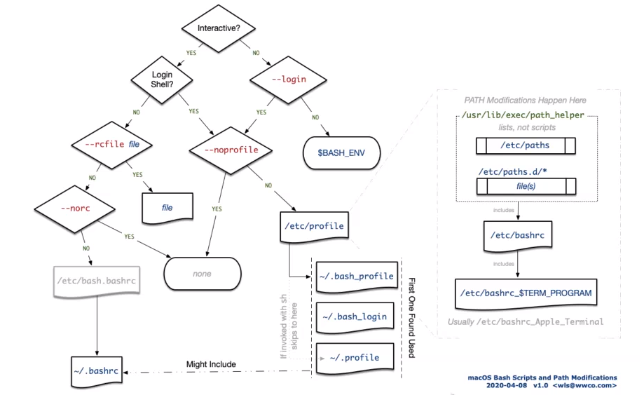

# Environment variables

- These exist globally on a specific machine or environment

- You don't want to have too many of them

- You can interpolate them into code and other services

**Agenda**
- Variables vs environment variables in bash
- Process and child processes
- Default variables
- How to set environment variables in bash

<br>

**Child processes**

- When your terminal runs another file or bash script it makes a child process

- A child process is basically a new terminal.

**Export**

- You can use `export` to export make a variable available to child processes

```bash
$ touch my_process.sh
# Here change the inside of this shell script to echo "this is a line from my process"
# And use it to echo MY_VAR
$ MY_VAR=hello
# Exporting this makes it available
$ export MY_VAR

# This makes the script an executable
$ chmod +x my_process.sh
$ ./my_process.sh
> This is a line from my process
> hello
```

- Still not permanent, will be lost when terminal is restarted

**Checking your variables**
```bash
printenv
env
```

**Making variables persisten in your computer**
- The definitive response lies in understanding how individual terminals are created

- The PATH taken

- Each individual terminal has a path to conclude before opening for you to use it

- To set an environment variable you are going to write in one of the files that it reads as it does it's PATH

<br>



# Examples
```bash
MY_VAR=hello
echo $MY_VAR
# RETURNS hello
```

```bash
DIR=$(pwd)
echo DIR
```
- These variables are not ENVIRONMENT VARIABLES and exist only on the process (the current terminal)

- Once you restart the terminal or a new process, these variables will no longer exist

```bash
touch 
```

- To turn a variable into a exectuable, use `chmod +x <scriptname>.sh`


- You want to have this in `.profile`
```bash
# if running bash
if [ -n "$BASH_VERSION" ]; then
    # include .bashrc if it exists
    if [ -f "$HOME/.bashrc" ]; then
        . "$HOME/.bashrc"
    fi
fi
```

<br>

**SUMMARY**

- `printenv` - prints all environment variables

- Environment variables can be referenced by putting `$` before them. As you can see the `HOME` env variable has value `/home/vagrant` and we need to put `$` to access this value
```bash
echo HOME
> HOME

echo $HOME
> /home/vagrant
```

- Use `env` and `set`


- You can then write in `.bashrc` the variables.

- how to turn variables into environment variables

**Covered:**
- Variables vs local variables
- How variables run in scripts and child processes
- How to create environment variables from variables
- How to make persistent variables that lasts between logins